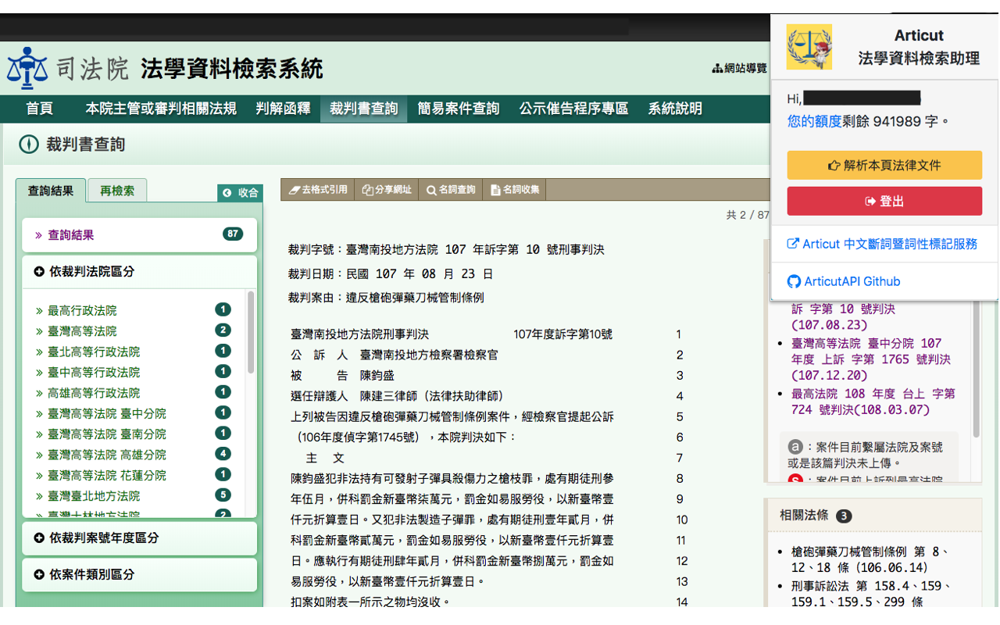
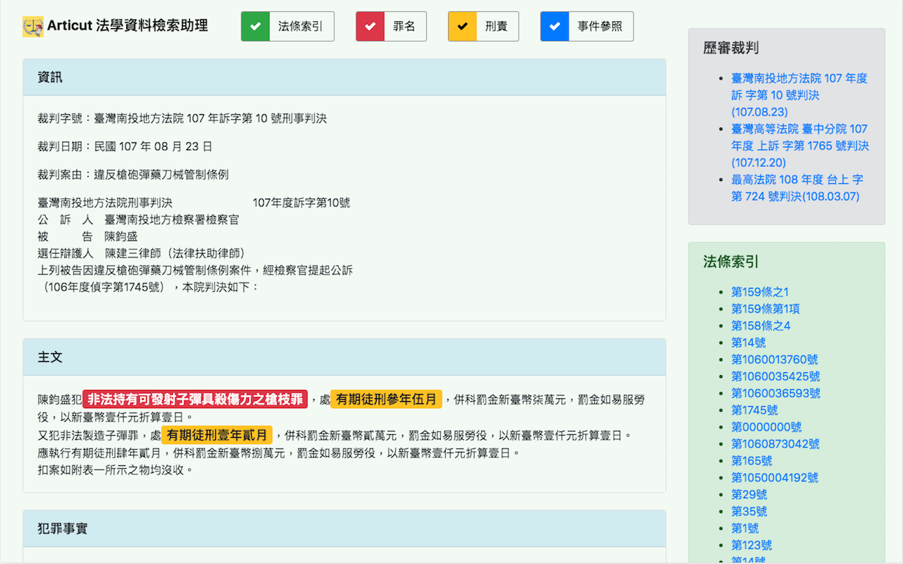
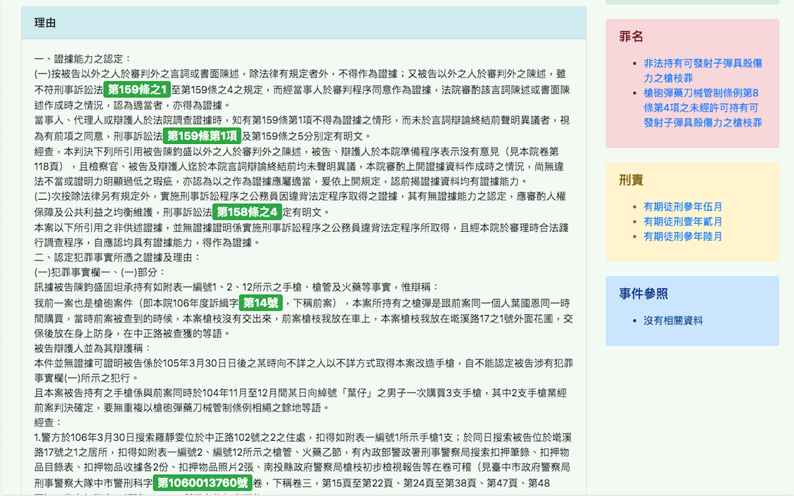

# LawsDocAssistant_tw

利用 [ArticutAPI](https://api.droidtown.co/product/) 設計的中華民國判決文檢索助理機器人。它能快速依勾選的項目將判文中的重點畫出來！ 

## 使用套件

* jQuery 3.1.0
* Bootstrap 4.0
* Font Awesome 4.7
* Animate.css 3.7.2

## 程式概念

1. 抓取需要分析的文件內容
2. 將內文送至 https://api.droidtown.co/Articut/API/ 進行斷詞
3. 將斷詞結果送至 https://api.droidtown.co/Articut/Toolkit/Laws/ 取得法律相關條文

## 操作範例

1. 點選`解析本頁法律文件`

2. 查看`法條索引`、`罪名`、`刑責`、`事件參照`等法律相關重點

## License

This project is licensed under the MIT License - see the [LICENSE](LICENSE) file for details